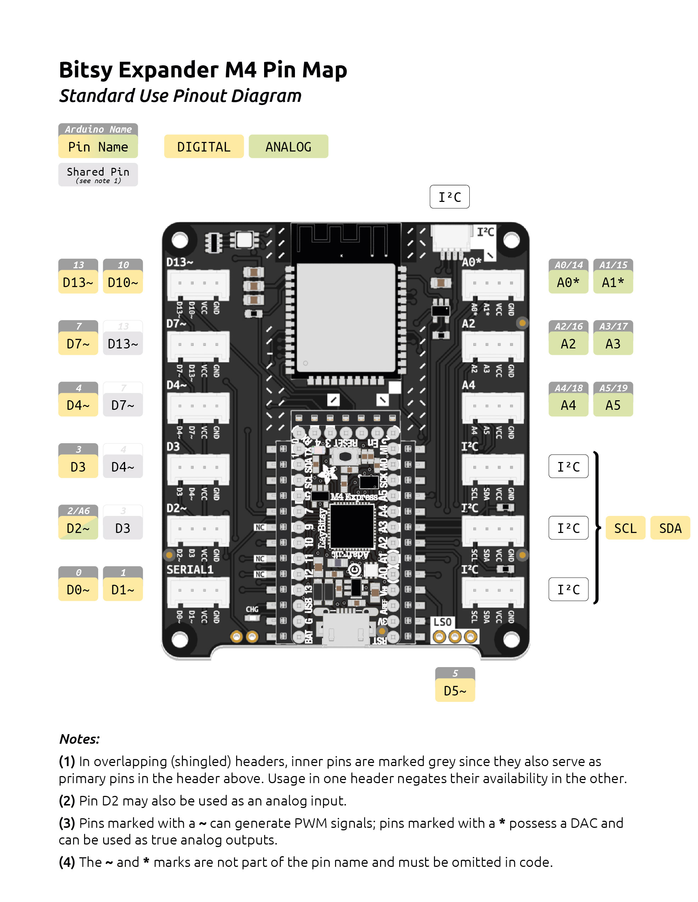
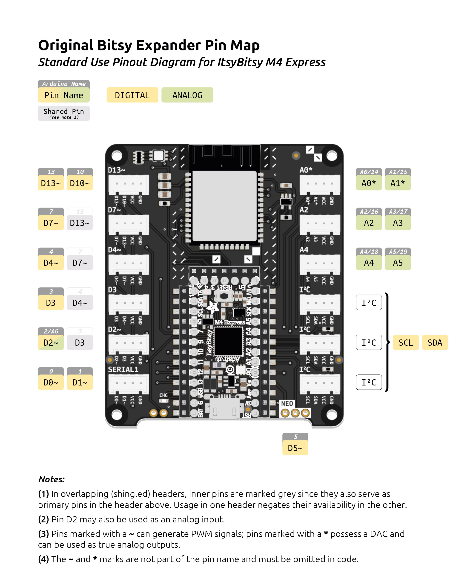
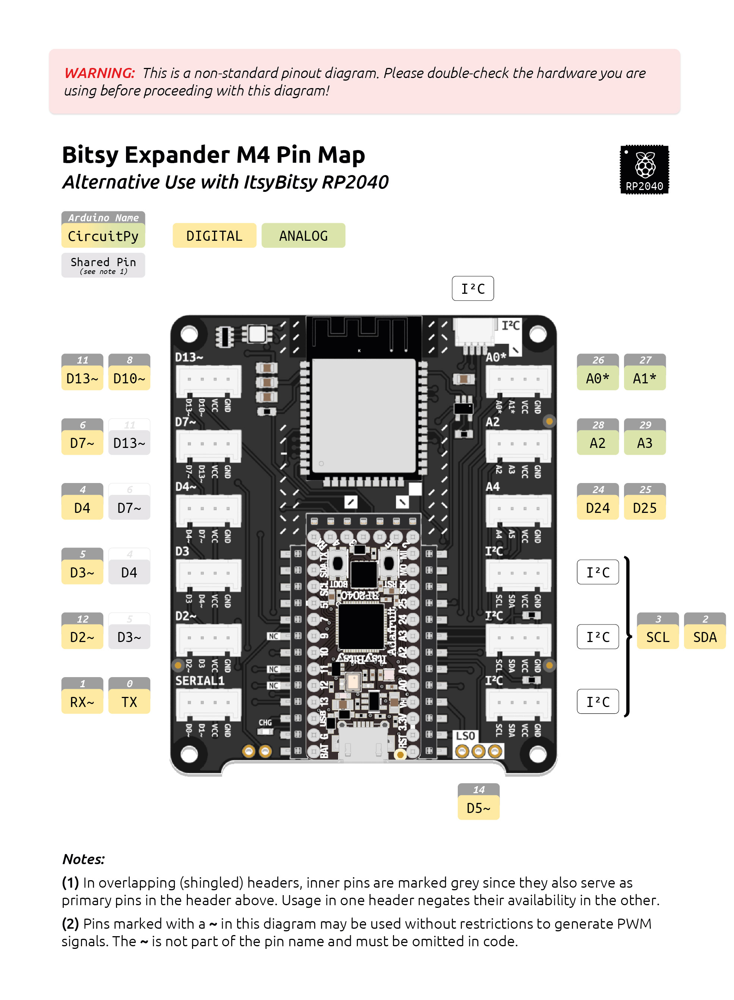

# Bitsy Expander M4 Pinout Diagrams
The ItsyBitsy M4 Express is a powerful and versatile development board powered by a 32-bit Cortex M4 core microcontroller running at 120 MHz. It features two 12-bit DACs, seven 12-bit ADCs, and plenty PWM-capable outputs. 

This page provides an overview of the pins made available via the Grove headers on the Bitsy Expander M4.

**For detailed information on the pinout of the ItsyBitsy M4 Express, refer to Adafruit's documentation:**  

[Adafruit ItsyBitsy M4 Express](https://learn.adafruit.com/introducing-adafruit-itsybitsy-m4)

**Jump ahead to pinout diagram:**

* [Pinout for Standard Usage](#standard-usage)
* [Original Bitsy Expander (Version 1.1)](#original-bitsy-expander-version-1-1)
* [Alternative Use with ItsyBitsy RP2040](#alternative-use-with-itsybitsy-rp2040)

## Standard Usage

## Original Bitsy Expander (Version 1.1)
The pinout of this version is identical to the version pictured above. The only major difference is the absence of the additional I²C header at the top of the board. This diagram serves as a visual reference for older boards still in circulation.

## Alternative Use with ItsyBitsy RP2040

Should you opt to use a Bitsy Expander M4 with an ItsyBitsy RP2040 development board, please refer to the pinout diagram below:

