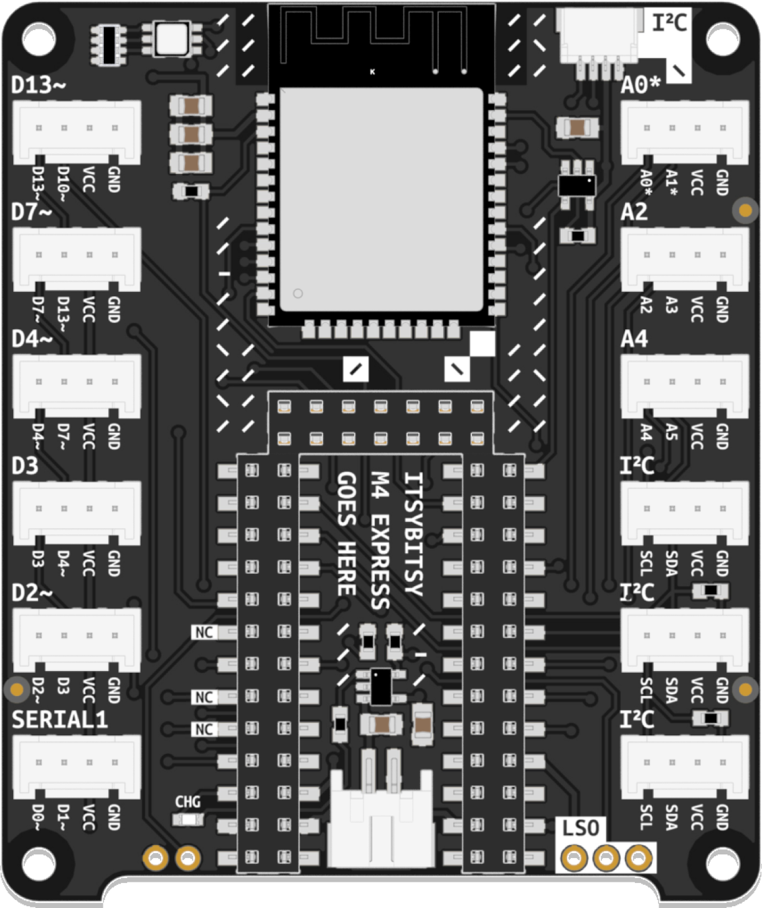
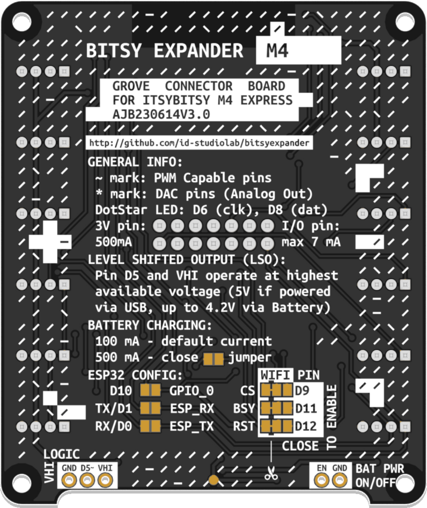
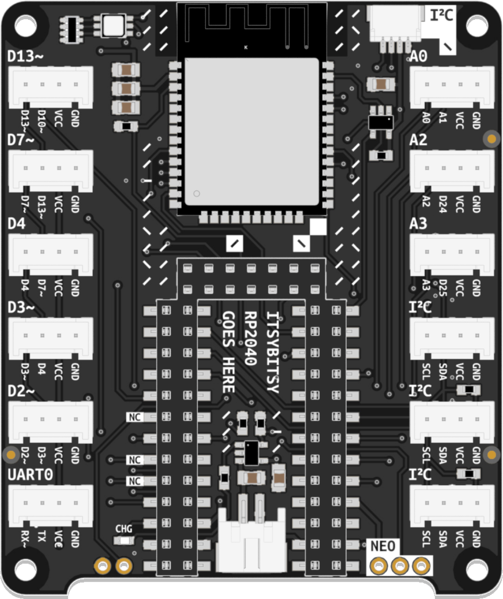
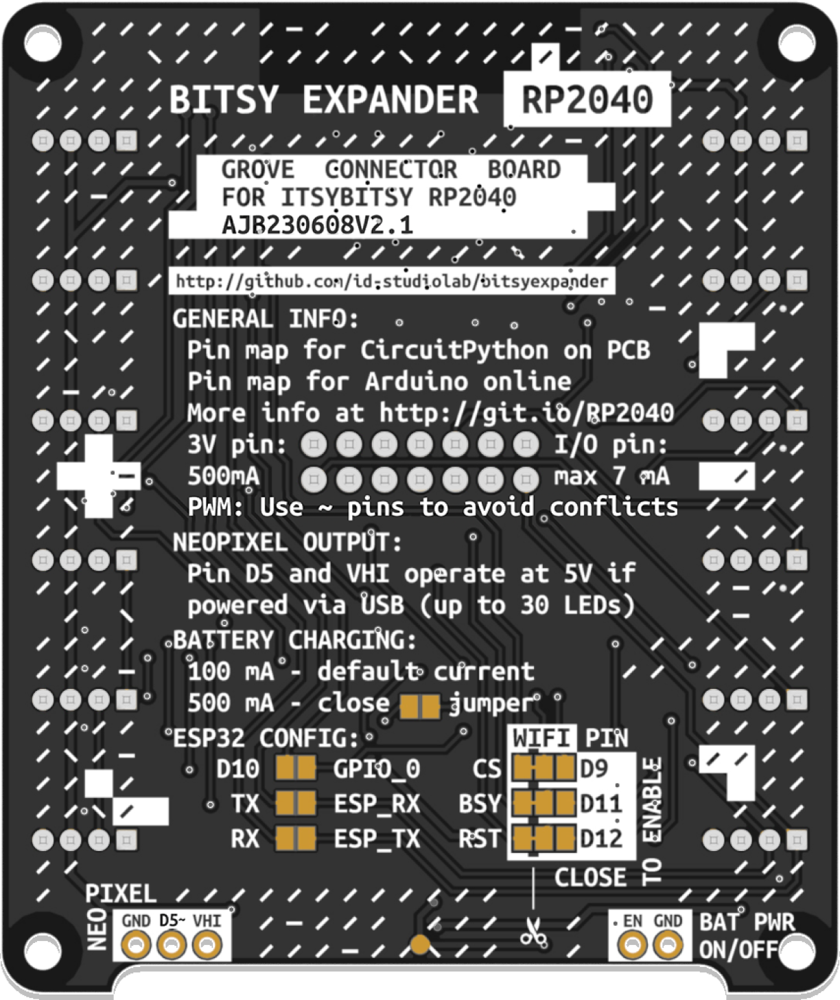

[![CC BY 4.0][cc-by-shield]][cc-by]

# Bitsy Expander
An expansion board adding support for the Grove solderless connector system, a WiFi radio, and LiPo battery charging circuitry to Adafruit ItsyBitsy Development Boards.

Compatible with all ItsyBitsy boards, the Bitsy Expander is available in two distinct flavors. The silkscreens on each flavor are specifically tailored to either the [ItsyBitsy M4 Express](https://www.adafruit.com/product/3800) or the [ItsyBitsy RP2040](https://www.adafruit.com/product/4888).

## General Information

### WiFi and BLE

The Bitsy Expander uses an ESP32 WROOM module to provide WiFi functionality to the microcontroller using [Adafruit's fork](https://github.com/adafruit/nina-fw) of the Arduino NINA-W102 firmware. In CircuitPython, this library also allows for the use of Bluetooth Low Energy (BLE).

To use the module with Circuitpython, use the [esp32spi](https://docs.circuitpython.org/projects/esp32spi/en/latest/) library. For Arduino, [Adafruit's forked WiFiNINA](https://github.com/adafruit/WiFiNINA/) library is required.

The ESP32 module is connected as follows:

| ESP32 Pin        | ItsyBitsy Pin |
| ---------------- | ------------- |
| Chip Select (CS) | D9            |
| Busy (BSY)       | D11           |
| Reset (RST)      | D12           |
| SPI Clock (SCK)  | SCK           |
| SPI MISO         | MISO          |
| SPI MOSI         | MOSI          |

### Solder Jumpers

The underside of the Bitsy Expander features a number of solder jumpers:

#### WIFI PIN:

These pins are used to connect the ItsyBitsy board to the ESP32 module on the Expander. If WiFi functionality is not needed but additional digital pins are required, these jumpers can be used to disable the WiFi module and make additional pins available in the double-row header on the upper side of the board. The traces between the middle and left pads must be severed before soldering a jumper in place between the middle and the right pads to do so.

#### ESP32 CONFIG:

These solder jumpers are normally open. If the ESP32 module requires a firmware update, these jumpers may be used to enable the ItsyBitsy to serve as a programming interface for the ESP32 module. Refer to [Adafruit's excellent tutorial](https://learn.adafruit.com/upgrading-esp32-firmware) on flashing firmware onto the ESP32.

#### BATTERY CHARGING:

The default battery charging current is 100mA. A faster, 500mA charging mode is available for batteries that support it. It can be enabled by closing the solder jumper.

## Bitsy Expander M4

### Preview

   

### Features

* 12 Grove Headers
  - 5 Digital Headers with overlapping (shingled) pins: D2, D3, D4, D7, D13
  - 1 Digital Header with exclusive pins: SERIAL1
  - 3 Analog Headers with exclusive pins: A0, A2, A4
  - 3 I²C Headers
* ESP32-WROOM Co-Processor for WiFi and BLE
* 1 JST SH 4-pin connector for Qwiic and STEMMA QT components (I²C)
* 1 JST PH 2-pin connector for 3.7V LiPo Batteries (chargeable via ItsyBitsy's USB port)
* 1 Logic-shifted output (allows driving components requiring 5V logic while powered via USB)

> NOTE: In shingled pin headers, each header's second pin is shared with the first pin in the header above it. Therefore, using one disables the other. For instance, using pins D3 and D4 in the  D3-labeled header disallows the use of D4 in the D4-labeled header.

## Bitsy Expander RP2040

### Preview

   

### Features

* 12 Grove Headers
  - 5 Digital Headers with overlapping (shingled) pins: D2, D3, D4, D7, D13
  - 1 Digital Header with exclusive pins: UART0
  - 3 Analog Headers with exclusive pins: A0, A2, A3 (A2 and A3 contain digital pins for their second pins)
  - 3 I²C Headers
* ESP32-WROOM Co-Processor for WiFi and BLE
* 1 JST SH 4-pin connector for Qwiic and STEMMA QT components (I²C)
* 1 JST PH 2-pin connector for 3.7V LiPo Batteries (chargeable via ItsyBitsy's USB port)
* 1 Logic-shifted output (allows driving components requiring 5V logic while powered via USB)

> NOTE: In shingled pin headers, each header's second pin is shared with the first pin in the header above it. Therefore, using one disables the other. For instance, using pins D3 and D4 in the  D3-labeled header disallows the use of D4 in the D4-labeled header.

## FAQ

#### How do I recognize which Bitsy Expander I have?

There are multiple ways to identify which Bitsy Expander flavor you own. The easiest is looking for the label on the back of the board. It will either explicitly state the flavor (RP2040 or M4) or, on older boards, have an empty label at the top (in which case it is an M4 board). Thes older M4 boards also lack the JST SH 4-pin connector at the top. 

#### Will any ItsyBitsy-type microcontroller work with the Bitsy Expander?

In principle, yes. The silkscreen on either flavor is specifically designed for either the [ItsyBitsy M4 Express](https://www.adafruit.com/product/3800) or the [ItsyBitsy RP2040](https://www.adafruit.com/product/4888), respectively. Pinouts differ only slightly, however. The expander has also been used successfully with the [ItsyBitsy M0 Express](https://www.adafruit.com/product/3727) in the past. This repository includes a number of pinout diagrams for different use-cases:

|      |      |      |
| ---- | ---- | ---- |
|      |      |      |
|      |      |      |
|      |      |      |

## Version History

| Version | Comment                                                      | Known Issues                                                 | Flavors            |
| ------- | ------------------------------------------------------------ | ------------------------------------------------------------ | ------------------ |
| **1.0** | Initial version                                              | Using pin D13 to drive the ESP Chip Select (CS) causes interference between the microcontroller's internal LED and the pull-up resistor | M4 Express         |
| 1.1     | – Uses pin D9 instead of D13 to drive the ESP Chip Select to prevent interference   – Adds a test point to the expander's underside for VBAT accessibility | Only two Grove headers provide direct access to Analog pins of used with RP2040 | M4 Express, RP2040 |
| **2.0** | – Adds a top-edge JST SH 4-pin connector for Qwiic and STEMMA QT compatibility   – Repositions pin A3 for better RP2040 analog pin access – Adds "NC" (not connected) labels to double-row header pins that are not normally broken out | Tilde (~) marks inaccurately represent freely configurable PWM pins on RP2040. *Note: all pins support PWM, subject to certain limitations.* | RP2040             |
| 2.1     | Silkscreen update to accurately depict a selection of freely configurable PWM pins on RP2040, preventing configuration conflicts among them |                                                              | RP2040             |
| **3.0** | – Reinstates original pin layout (identical to V1) for sequential analog pin placement on M4 Express  – Maintains JST SH-4 connector and VBAT test point inherited from previous versions |                                                              | M4 Express         |

This is the sibling of the [Nano Expander](https://github.com/id-studiolab/NanoExpander), a Grove expansion board for [Arduino Nano 33 IoT](https://store.arduino.cc/products/arduino-nano-33-iot).

This work is licensed under a
[Creative Commons Attribution 4.0 International License][cc-by].

[![CC BY 4.0][cc-by-image]][cc-by]

[cc-by]: http://creativecommons.org/licenses/by/4.0/
[cc-by-image]: https://i.creativecommons.org/l/by/4.0/88x31.png
[cc-by-shield]: https://img.shields.io/badge/License-CC%20BY%204.0-lightgrey.svg
