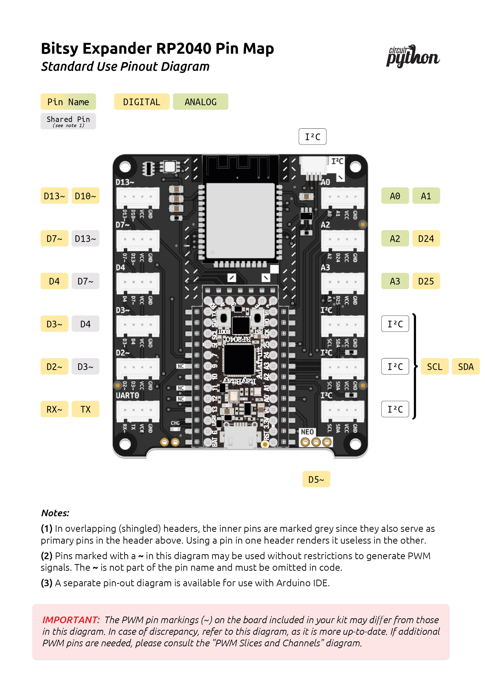
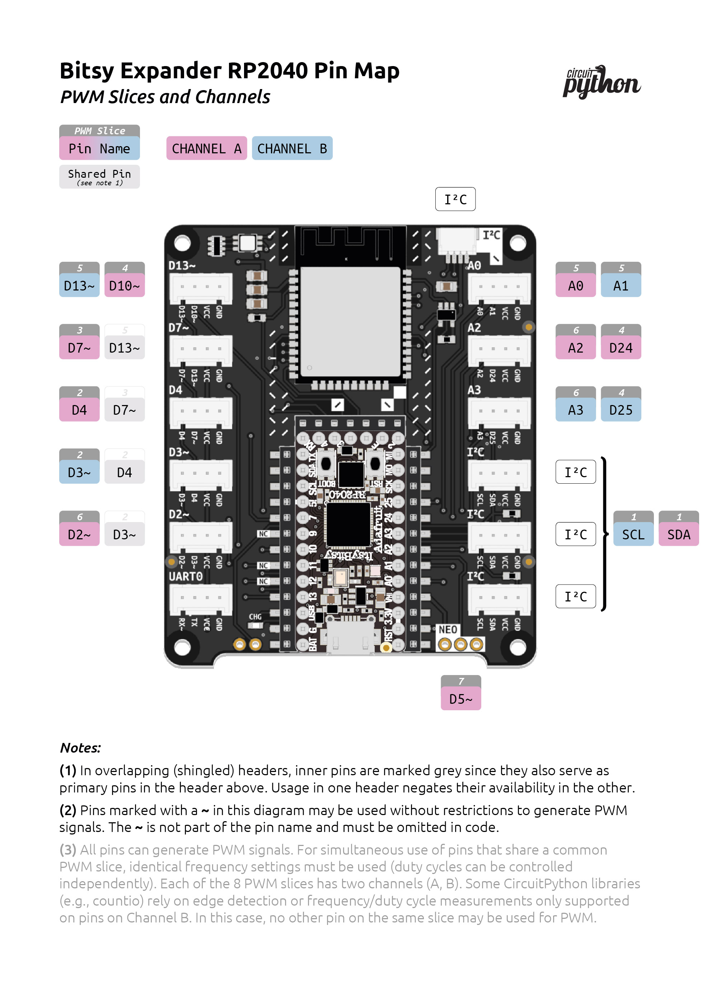
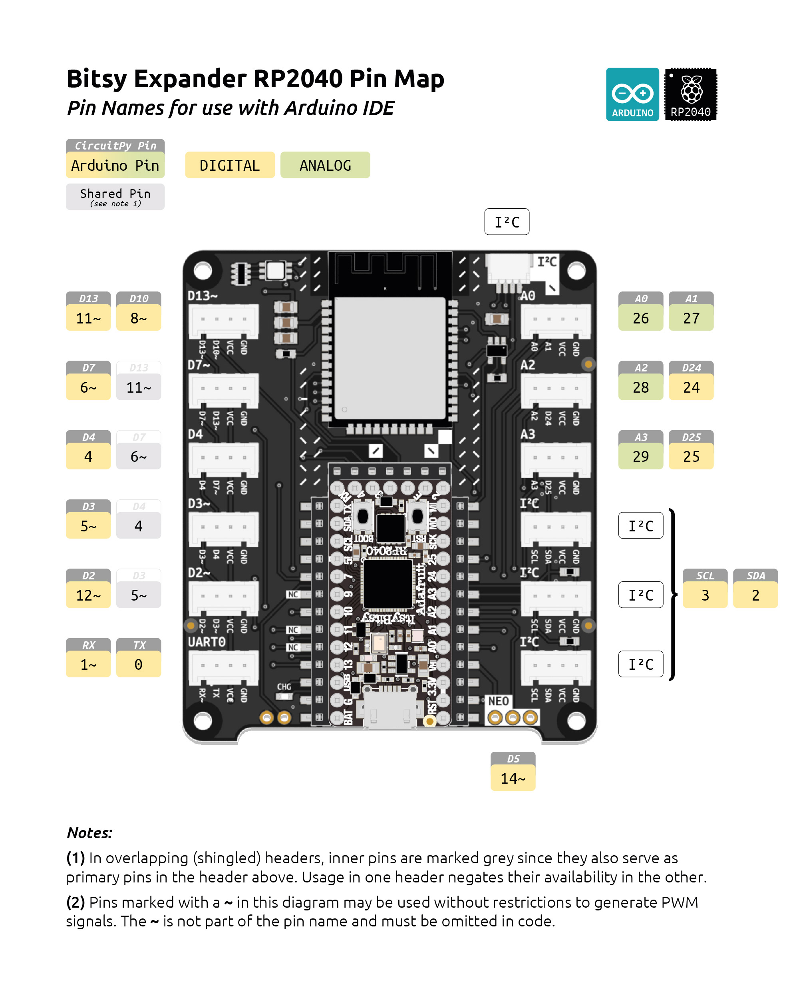
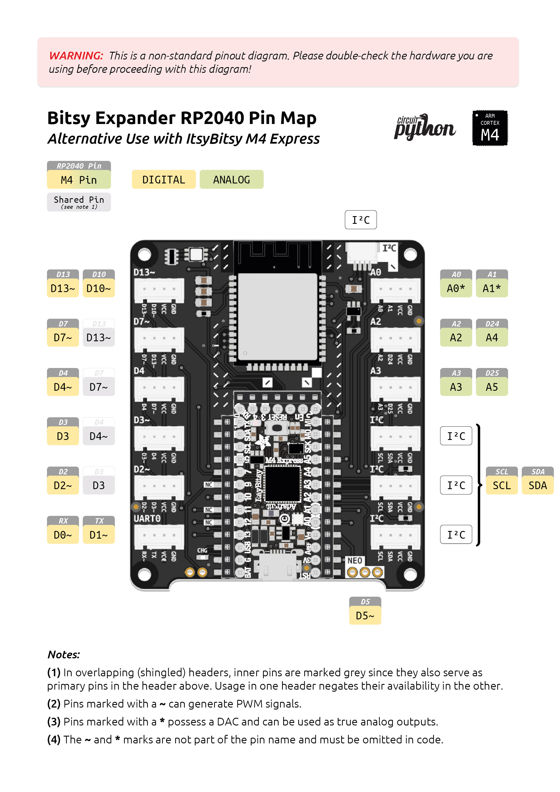

# Bitsy Expander RP2040 Pinout Diagrams
Unlike the ItsyBitsy M4, which includes two more analog pins (and two DACs), the RP2040 replaces these with two additional digital pins. The RP2040 affords greater flexibility in GPIO pin usage, but extra planning and research may be needed to fully leverage this advantage.

**For detailed information on the ItsyBitsy RP2040's pinout, refer to Adafruit's documentation:**  

[Adafruit ItsyBitsy RP2040](https://learn.adafruit.com/adafruit-itsybitsy-rp2040)

**Jump ahead to pinout diagram:**

* [Pinout for Standard Usage](#standard-usage)
* [Advanced PWM and PIO Reference](#advanced-pwm-and-pio-reference)
* [Pinout for use in Arduino IDE](#arduino-support)
* [Alternative Use with ItsyBitsy M4 Express](#alternative-use-with-itsybitsy-m4-express)

## Standard Usage

## Advanced PWM and PIO Reference
The RP2040 is a highly capable microcontroller that features flexible hardware support for Pulse Width Modulation (PWM) and Programmable I/O (PIO). With 8 available PWM slices, each offering 2 channels, and 2 PIO  blocks with 4 state machines each, developers can control a variety of digital peripherals and create custom digital interfaces.

However, this versatility necessitates careful planning. While every IO can generate PWM signals, restrictions apply to the simultaneous use of specific pins. (e.g., pins sharing a common PWM slice must adopt identical frequency settings.) These constraints allow simultaneous PWM use of all pins for many standard use-cases. For scenarios requiring custom settings, the silkscreen displays marks (~) for a group of pins that can be freely configured without causing conflicts. For more advanced needs, the diagram below serves as a reference. Please refer to Note 3 in the diagram for more information.

## Arduino Support
The pin markings on both the BitsyExpander RP2040 and the ItsyBitsy RP2040 itself are exclusively applicable for use with [CircuitPython](https://circuitpython.org/board/adafruit_itsybitsy_rp2040/). To program the board using [Arduino](https://learn.adafruit.com/adafruit-itsybitsy-rp2040/arduino-ide-setup), use the pin map provided here.

**Relevant links:**  
[Arduino IDE set-up for ItsyBitsy RP2040](https://learn.adafruit.com/adafruit-itsybitsy-rp2040/arduino-ide-setup)  
[Earlephilhower's Pi Pico Arduino Core](https://github.com/earlephilhower/arduino-pico/#arduino-pico)  

## Alternative Use with ItsyBitsy M4 Express

Should you opt to use a Bitsy Expander RP2040 with an ItsyBitsy M4 Express development board, please refer to the pinout diagram below:

